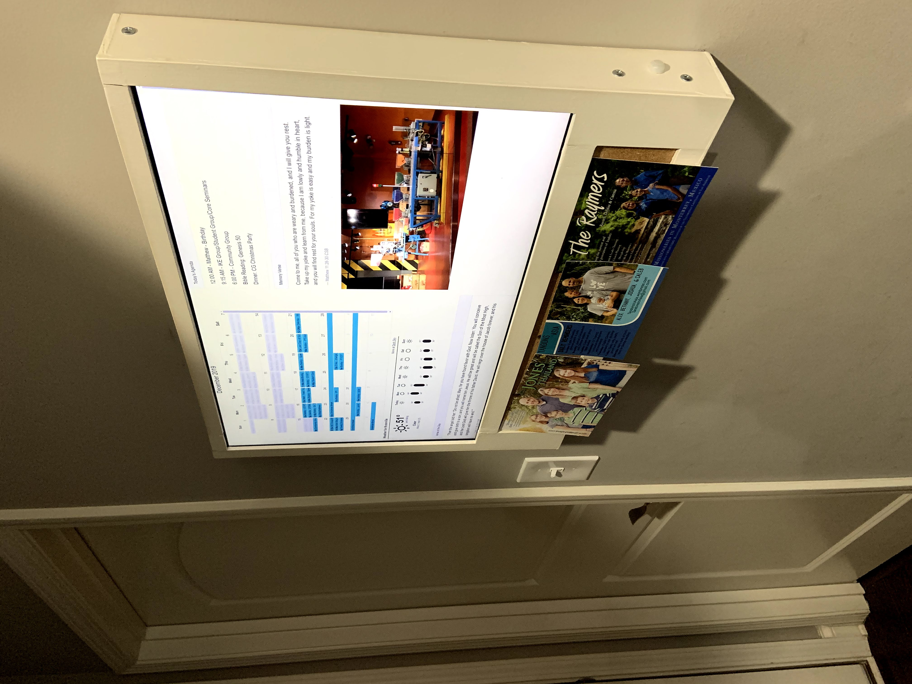

# Rob's Wall Calendar

This repo holds a handful of our scripts and tools that we assembled to provide 
our family's digital wall calendar. In general, the platform takes a "more 
simple is better" approach. This was inspired by, but shares no code with the 
[MagicMirror project](https://github.com/MichMich/MagicMirror) which may be of 
interest to some.

## Installation

The following details how I set things up on my system. You may well change it 
based on your environment, but this should give you an idea of what to do.

1. Setup a PI, running a recent version of Raspbian
1. Place the utility scripts in a directory of your choosing. I used `/home/pi/`
1. 


## Data Retrieval

The script (`utilites/get_calendars.sh`) is used to get the data (`*.ics files`) 
from Google. If you edit the file in a test editor, you will see the enviornment 
variables you need to set (calendar URLs). Once this is set, run it once to 
ensure that it works and the proper ICS files are written. After you are sure it 
works, you may choose to schedule it to run periodically via `crontab`. In my 
setup, it runs every hour.

```bash
# run crontab as root
$ sudo crontab -e

# select prefer editor if prompted

# edit the file to have a line that looks something like the following:

# m h  dom mon dow   command                                                                                                                                         
0 * * * * /home/pi/get_calendars.sh
```


## Preview

This gives you an idea of what the calendar looks like on our wall




## Related Links

- [MagicMirror](https://github.com/MichMich/MagicMirror)
