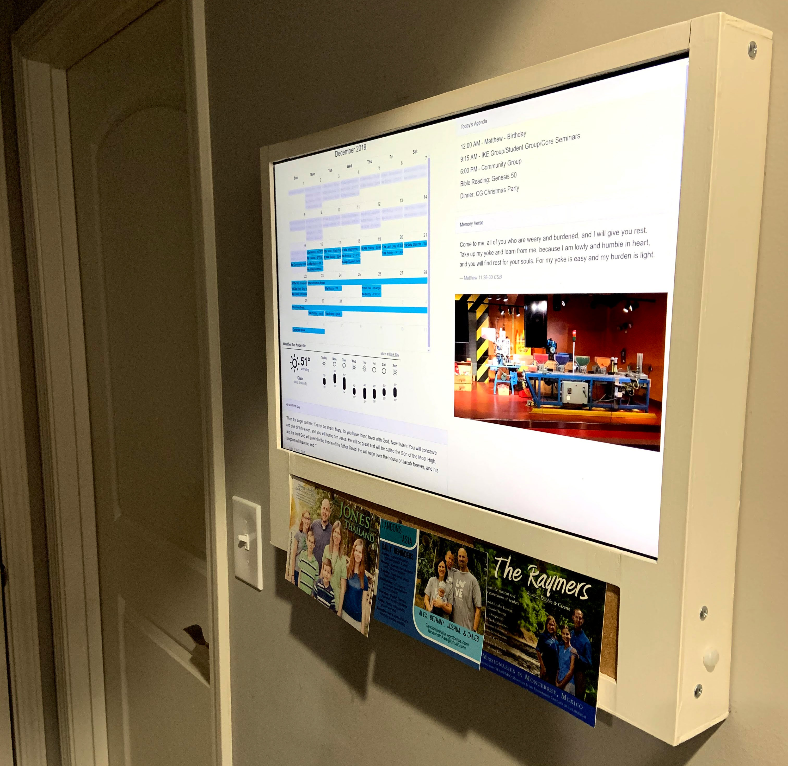

# Rob's Wall Calendar

This repo holds a handful of our scripts and tools that we assembled to provide 
our family's digital wall calendar. In general, the platform takes a "more 
simple is better" approach. This was inspired by, but shares no code with the 
[MagicMirror project](https://github.com/MichMich/MagicMirror) which may be of 
interest to some.

## Preview

This gives you an idea of what the calendar looks like on our wall

## Related Links

- [MagicMirror](https://github.com/MichMich/MagicMirror)
